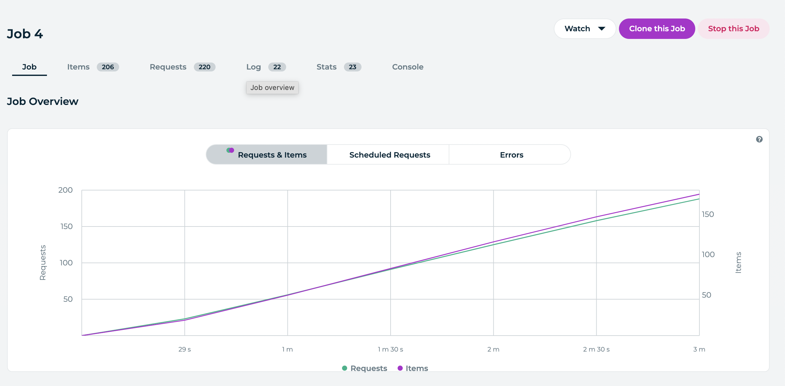
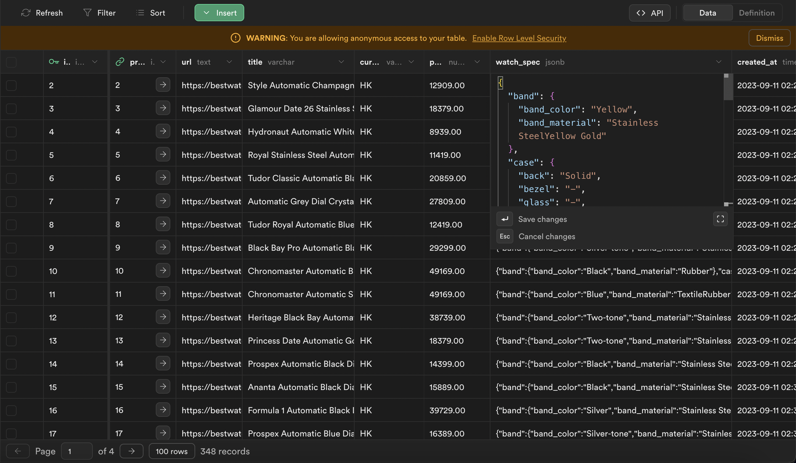

# Scrapy Practice

## Inspiration:

[Scrapy Course – Python Web Scraping for Beginners](https://www.youtube.com/watch?v=mBoX_JCKZTE)  

## Website to scrape:  
Finished: [SSR website: BestWatch](https://bestwatch.com.hk/sale.html)  
WIP: [Data from API website: Strata](https://strata.ca)

## Screenshots
Job Overview on Zyte (Scrapy Cloud)


Data stored on Supabase



## Installation

```
python3.11 -m venv venv
source venv/bin/activate
pip3 install scrapy ipython psycopg2-binary shub
```

## Configuration

```
# In scrapy.cfg:
shell = ipython

```

## How to Use

```
# Output to console ( & database if pipeline is set)
scrapy crawl bestwatchspider

# Output to csv
scrapy crawl bestwatch -O bestwatch.csv
```

## Deployment at [Zyte](https://app.zyte.com/)  
```
$ pip install shub
$ shub login
$ shub deploy {id}
```

## Practice area

```
scrapy shell

# Server side
fetch('http://strata.ca/')
response
response.css('div.listingTile')
response.css('div.listingTile').get()
listings = response.css('div.listingTile')
```