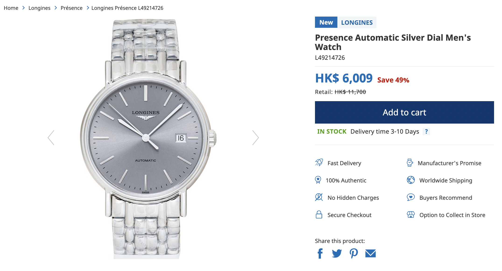
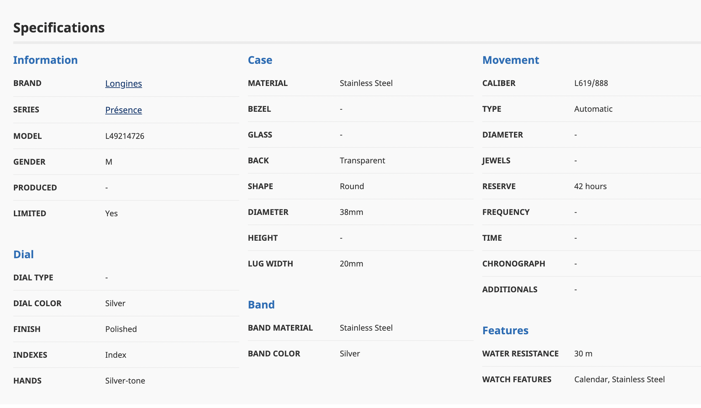

# Scrapy Practice

## Inspiration:

[Scrapy Course – Python Web Scraping for Beginners](https://www.youtube.com/watch?v=mBoX_JCKZTE)  

## Website to scrape:  
Finished: [SSR website: BestWatch](https://bestwatch.com.hk/sale.html)  
WIP: [Data from API website: Strata](https://strata.ca)

## Screenshots
Job Overview on Zyte (Scrapy Cloud)


Data stored on Supabase


## Sample data
Website: https://bestwatch.com.hk/longines-presence-l49214726.html  
Screenshots:
Sample Overview


Sample watch specification


```
# watch_spec:
{
  "band": {
    "band_color": "Silver",
    "band_material": "Stainless Steel"
  },
  "case": {
    "back": "Transparent",
    "bezel": "-",
    "glass": "-",
    "shape": "",
    "height": "-",
    "diameter": "38mm",
    "material": "Stainless Steel",
    "lug_width": "20mm"
  },
  "dial": {
    "hands": "Silver-tone",
    "finish": "Polished",
    "indexes": "Index",
    "dial_type": "-",
    "dial_color": "Silver"
  },
  "features": {
    "watch_features": "Calendar, Stainless Steel",
    "water_resistance": "30 m"
  },
  "movement": {
    "time": "-",
    "type": "Automatic",
    "jewels": "-",
    "caliber": "L619/888",
    "reserve": "42 hours",
    "diameter": "-",
    "frequency": "-",
    "additionals": "-",
    "chronograph": "-"
  },
  "information": {
    "brand": "Longines",
    "model": "L49214726",
    "gender": "M",
    "series": "Présence",
    "limited": "Yes",
    "produced": "-"
  }
}
```

## Installation

```
python3.11 -m venv venv
source venv/bin/activate
pip3 install scrapy ipython psycopg2-binary shub
```

## Configuration

```
# In scrapy.cfg:
shell = ipython

```

## How to Use

```
# Output to console ( & database if pipeline is set)
scrapy crawl bestwatchspider

# Output to csv
scrapy crawl bestwatch -O bestwatch.csv
```

## Deployment at [Zyte](https://app.zyte.com/)  
```
$ pip install shub
$ shub login
$ shub deploy {id}
```

## Practice area

```
scrapy shell

# Server side
fetch('http://strata.ca/')
response
response.css('div.listingTile')
response.css('div.listingTile').get()
listings = response.css('div.listingTile')
```